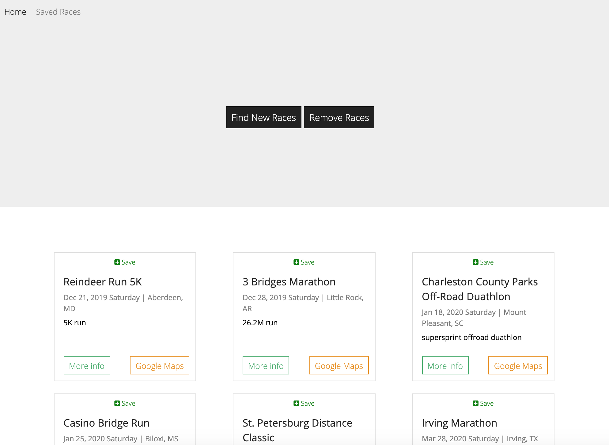

# Run Scraper

Run Scraper is a web-based application that scrapes www.runningintheusa.com for the latest road and trail races across the country. The app performs all CRUD operations and includes the ability to save races and add notes or comments to a race. 

## Getting Started

To view the project, you may visit the deployed version of the site or visit the repo, both linked below within the Author section. 

### Prerequisites

Have access to an internet browser. 

## Run Scraper Demo

Run Scraper scrapes the webmaster "picks" from the home page of www.runningintheusa.com and displays those races on the app's home page. Users have the ability to remove races if they would like and run the scrape again. Users may also save races, after which they'll be displayed in the saved races page. User may also leave "notes" on a race with their saved races and have the ability to delete those notes as well. 

## Built With
* CSS3
* [Handelbars](https://handlebarsjs.com/) - Templating Engine
* [BootStrap](https://getbootstrap.com/) - CSS Framework  
* [JavaScript](https://www.npmjs.com/package/cli-table3) - Vanilla JS
* [jQuery](https://jquery.com/) - To help capture the user inputs 
* [Node.js](https://nodejs.org/en/) - Server-side javascript  
* [MongoDB](https://www.mysql.com/) - NoSQL database to store scraping and user data
* [Express](https://expressjs.com/) - Node.js web application to build server 
* [Cheerio](https://www.npmjs.com/package/cheerio) - NPM package to parse markup 
* [Axios](https://www.npmjs.com/package/axios) - Http client

## Author

* **Tomas Gear** - *https://github.com/nexio-t* - [Run Scraper Repo](https://github.com/nexio-t/web-scraper)

